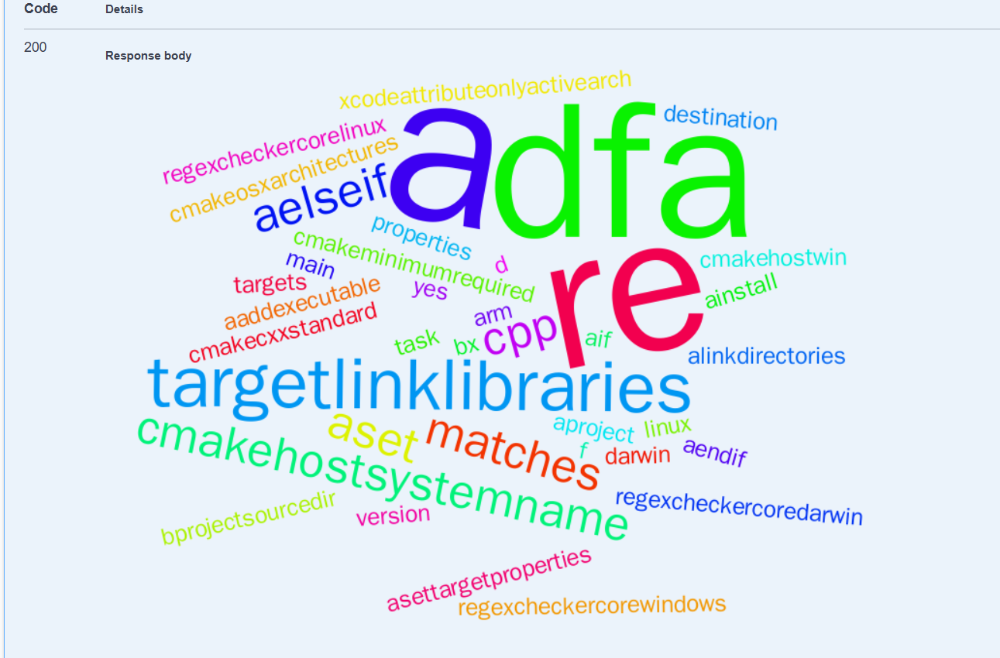

# Домашнее задание по КПО номер 2 или Контрольная работа по КПО номер 2

#### Сокуров Идар БПИ233

## Важно

Для отрисовывания облака слов файл должен представлять собой более-менее осмысленный текст
(в том смысле, что если передать двоичный файл или что-то специфичное(.docx) то в ответе будет BadRequest)

Покрытие тестами:

- analysis 80%
- storage 74%

Gateway не тестировал(т.к. там как такового кода и нет)

Сервер Api Gateway запускается локально, прослушивается порт 8080.

Для работы с API можно использовать страницу (там же сверху-справа можно переключить API на другие
сервисы) http://localhost:8080/swagger-ui/index.html#/

## Общая структура

Проект представляет систему из 3-х (2 полноценных + gateway) микросервисов.

## Функционал

Все требования из задания выполнены

В том числе отрисовка облака слов

Пример облака слов:


## Запуск

Точкой входа в приложение является класс Application(для каждого микросервиса).

Для сборки используется Gradle.

Для контейнеризации используется Docker.

Для оркестрации используется docker-compose.

База данных PostgreSQL

Для запуска можно использовать команду

```bash 
docker-compose up
``` 